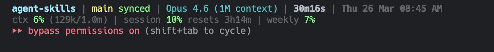

# Claude Code Status Line

A clean, informative status line for [Claude Code](https://docs.anthropic.com/en/docs/claude-code) built with pure Bash. No dependencies beyond `jq` and `git`.

## Preview



## What It Shows

### Line 1 - Project Info

| Segment | Description |
|---------|-------------|
| **Project** | Current folder name (bold yellow) |
| **Branch** | Git branch with status (magenta) |
| **Git Status** | `synced` / `uncommitted` / `3 unpushed` / `2 behind` |
| **Model** | Current Claude model (cyan) |
| **Duration** | Session duration (e.g., `20m22s`) |
| **Date/Time** | Current date and time with AM/PM |

### Line 2 - Usage Metrics

| Segment | Description |
|---------|-------------|
| **ctx** | Context window usage with token count (e.g., `5% (128k/1.0m)`) |
| **session** | 5-hour session rate limit with reset countdown |
| **weekly** | 7-day all-models rate limit with reset countdown |

All percentages are color-coded: **green** (< 50%), **yellow** (50-79%), **red** (80%+).

## Requirements

- [Claude Code](https://docs.anthropic.com/en/docs/claude-code)
- [jq](https://jqlang.github.io/jq/) - JSON processor
- `git` - for branch/status info

## Installation

### Quick Install

```bash
git clone https://github.com/AsyrafHussin/claude-code-statusline.git
cd claude-code-statusline
./install.sh
```

### Manual Install

1. Copy the script:

```bash
cp statusline.sh ~/.claude/statusline-command.sh
chmod +x ~/.claude/statusline-command.sh
```

2. Add to `~/.claude/settings.json`:

```json
{
  "statusLine": {
    "type": "command",
    "command": "bash ~/.claude/statusline-command.sh"
  }
}
```

3. Restart Claude Code.

### Windows

The status line is a Bash script, so on Windows it runs through **Git Bash** (bundled with [Git for Windows](https://git-scm.com/download/win)). Two things differ from macOS/Linux:

1. **Dependencies must be reachable by Git Bash.** Install `jq` and Git, then make sure Git Bash's `bin` folder is on your PATH so `bash` resolves:

   ```powershell
   winget install jqlang.jq
   winget install Git.Git
   # Add Git Bash to PATH (so `bash` is found), then open a NEW terminal:
   [Environment]::SetEnvironmentVariable(
     "Path",
     [Environment]::GetEnvironmentVariable("Path","User") + ";C:\Program Files\Git\bin",
     "User")
   ```

2. **Use a forward-slash (Unix-style) path in the command.** Claude Code runs the status line via `sh`, which treats backslashes as escapes — a `C:\...` path silently breaks. Use `/c/Users/...` instead.

#### Quick Install (PowerShell)

```powershell
git clone https://github.com/AsyrafHussin/claude-code-statusline.git
cd claude-code-statusline
./install.ps1
```

#### Manual Install (Windows)

1. Copy the script to `%USERPROFILE%\.claude\statusline-command.sh`.
2. Add to `~/.claude/settings.json` (note the `/c/Users/<you>/...` path):

   ```json
   {
     "statusLine": {
       "type": "command",
       "command": "bash /c/Users/<you>/.claude/statusline-command.sh"
     }
   }
   ```

3. Restart Claude Code.

> **Tip:** If `jq` isn't picked up by the status line hook, copy `jq.exe` into a folder already on Git Bash's PATH (e.g. `%USERPROFILE%\bin`).

## Git Status Indicators

| Status | Color | Meaning |
|--------|-------|---------|
| `synced` | Green | Clean and up to date with remote |
| `uncommitted` | Red | Uncommitted local changes |
| `3 unpushed` | Yellow | 3 commits not pushed to remote |
| `2 behind` | Red | Remote has 2 commits you haven't pulled |
| `unpushed` | Yellow | No remote tracking branch |

## Customization

Edit `~/.claude/statusline-command.sh` to customize colors, segments, or layout. The script receives a JSON payload from Claude Code via stdin with fields like:

- `model.display_name` - Current model
- `context_window.used_percentage` - Context usage
- `rate_limits.five_hour.used_percentage` - Session rate limit
- `rate_limits.seven_day.used_percentage` - Weekly rate limit
- `cost.total_duration_ms` - Session duration

See the [Claude Code statusline docs](https://docs.anthropic.com/en/docs/claude-code/statusline) for all available fields.

## License

[MIT](LICENSE)
