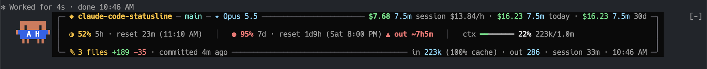

# Claude Code Status Line

A clean, informative status line for [Claude Code](https://docs.anthropic.com/en/docs/claude-code) built with pure Bash. No dependencies beyond `jq` and `git`.

## Preview



## What It Shows

### Line 1 - Project Info

| Segment | Description |
|---------|-------------|
| **Project** | Current folder name (bold yellow) |
| **Branch** | Git branch with status (magenta) |
| **Git Status** | Uncommitted files and lines, unpushed commits and lines, behind, stashes, time since the last commit |
| **Model** | Current Claude model (cyan) |
| **Duration** | Session duration (e.g., `20m22s`) |
| **Date/Time** | Current date and time with AM/PM |

### Line 2 - Usage Metrics

| Segment | Description |
|---------|-------------|
| **ctx** | Context window usage with token count (e.g., `5% (128k/1.0m)`) |
| **session** | 5-hour session rate limit with reset countdown and local reset time |
| **weekly** | 7-day all-models rate limit with reset countdown and local reset time; `! out ~7h` when the pace so far would use it up before the reset |

All percentages are color-coded: **green** (< 50%), **yellow** (50-79%), **red** (80%+).

## Requirements

- [Claude Code](https://docs.anthropic.com/en/docs/claude-code)
- [jq](https://jqlang.github.io/jq/) - JSON processor
- `git` - for branch/status info

## Installation

### Quick Install

```bash
git clone https://github.com/AsyrafHussin/claude-code-statusline.git
cd claude-code-statusline
./install.sh
```

### Manual Install

1. Copy the script:

```bash
cp statusline.sh ~/.claude/statusline-command.sh
chmod +x ~/.claude/statusline-command.sh
```

2. Add to `~/.claude/settings.json`:

```json
{
  "statusLine": {
    "type": "command",
    "command": "bash ~/.claude/statusline-command.sh"
  }
}
```

3. Restart Claude Code.

### Windows

The status line is a Bash script, so on Windows it runs through **Git Bash** (bundled with [Git for Windows](https://git-scm.com/download/win)). Two things differ from macOS/Linux:

1. **Dependencies must be reachable by Git Bash.** Install `jq` and Git, then make sure Git Bash's `bin` folder is on your PATH so `bash` resolves:

   ```powershell
   winget install jqlang.jq
   winget install Git.Git
   # Add Git Bash to PATH (so `bash` is found), then open a NEW terminal:
   [Environment]::SetEnvironmentVariable(
     "Path",
     [Environment]::GetEnvironmentVariable("Path","User") + ";C:\Program Files\Git\bin",
     "User")
   ```

2. **Use a forward-slash (Unix-style) path in the command.** Claude Code runs the status line via `sh`, which treats backslashes as escapes — a `C:\...` path silently breaks. Use `/c/Users/...` instead.

#### Quick Install (PowerShell)

```powershell
git clone https://github.com/AsyrafHussin/claude-code-statusline.git
cd claude-code-statusline
./install.ps1
```

#### Manual Install (Windows)

1. Copy the script to `%USERPROFILE%\.claude\statusline-command.sh`.
2. Add to `~/.claude/settings.json` (note the `/c/Users/<you>/...` path):

   ```json
   {
     "statusLine": {
       "type": "command",
       "command": "bash /c/Users/<you>/.claude/statusline-command.sh"
     }
   }
   ```

3. Restart Claude Code.

> **Tip:** If `jq` isn't picked up by the status line hook, copy `jq.exe` into a folder already on Git Bash's PATH (e.g. `%USERPROFILE%\bin`).

## Git Status Indicators

| Status | Color | Meaning |
|--------|-------|---------|
| `synced` | Green | Clean and up to date with remote |
| `3 files +92 -47` | Yellow | 3 files with uncommitted changes, and their lines |
| `↑3 commits +518` | Yellow | 3 commits not pushed to remote, and their lines |
| `↓2 behind` | Red | Remote has 2 commits you haven't pulled |
| `≡1 stash` | Cyan | Stashed changes waiting |
| `no upstream` | Yellow | No remote tracking branch |
| `committed 2h ago` | Dim | Time since the last commit |

## Mod: Panel Above the Prompt

`mod/statusline-band` is a [Claude Code mod](https://code.claude.com/docs/en/plugins/mods/overview) that shows the same information as a panel above the prompt, with Clawd, the Claude Code mascot, beside it. It needs Claude Code v2.1.287 or later.

```
              ╭─ ◆ claude-code-statusline ─ main ─ ✦ Opus 5.5 ───────────────────────────── $7.01 2.1m session $12.09/h · $9.06 4.3m today · $84.30 41m 30d ─╮
   ▐▛███▜▌    │                                                                                                                                              │
  ▝▜ A H ▛▘   │  ◑ 47% 5h · reset 1h1m (11:09 AM)   │   ● 94% 7d · reset 1d9h (Sat 8:00 PM) ▲ out ~8h   │   ctx ━━━━━━━━ 24% 238k/1.0m                       │
    ▘▘ ▝▝     │                                                                                                                                              │
              ╰─ ✎ 2 files +57 −16 · ↑ 3 commits +518 · committed 2h ago ──────────────────────────────────────── in 1.2m · out 4k · session 34m · 10:08 AM ─╯
```

| Part | Description |
|------|-------------|
| **Top edge** | Repo name (with the subfolder dimmed when you're in one), branch, model; cost on the right |
| **5h / 7d** | Rate limits as filling rings, with the reset countdown and the local reset time; `▲ out ~8h` when the pace would use it up before the reset, taking the faster of the whole window's pace and the last few hours' |
| **ctx** | Context usage as a bar, with tokens used out of the window |
| **Cost** | Session cost and hourly rate, plus today's and the last 30 days' spend across sessions; each with its tokens (read and written, cache included), counted from when the mod was installed |
| **Bottom edge** | Running subagents; the last reply's input (with the cached share) and output tokens on the right beside the session time; uncommitted files and lines, unpushed commits and their lines, commits behind, stashes, time since the last commit; then session duration and the time |
| **Card** | A near-black card behind the frame, with empty rows around the stats |
| **Clawd** | Stands and blinks when idle, runs while Claude works; the border turns orange too |

Hover over a rate limit for its pace: across the window, over the last 3 hours, and when it would run out. Click the `30d` label on the top right, or run `/usage-history`, to open a pane with each of the last 30 days' cost and tokens. Running subagents show on the bottom left as `↻ 2 agents`, and the last reply's input shows how much came from the cache.

### Settings

Each is a row in `/config`, or set them in `~/.claude/settings.json`:

```json
{
  "pluginConfigs": {
    "statusline-band": {
      "options": { "initials": "AH", "cardColor": "#0a0a0a", "padRows": 1, "historyDays": 30, "fetchMinutes": 5 }
    }
  }
}
```

| Setting | Default | What it does |
|---------|---------|--------------|
| `initials` | empty | Up to two letters on Clawd's shirt |
| `cardColor` | `#0a0a0a` | Background of the card |
| `padRows` | `1` | Empty rows above and below the stats, 0 to 2 |
| `historyDays` | `30` | Days the rolling cost and the history pane cover, 7 to 62 |
| `fetchMinutes` | `5` | How often the upstream is fetched; `0` turns it off |

It fetches the upstream in the background every 5 minutes by default (never prompting for credentials) so `behind` stays current. It also toasts once when a rate limit passes 80% and 95%, and once when its pace would use it up before the reset, and shows a `compact` button when context passes 80%.

To load it in every session, add its folder to the `env` block of `~/.claude/settings.json` (and remove `statusLine` if you no longer want the Bash version as well):

```json
{
  "env": {
    "CLAUDE_CODE_PLUGIN_DIRS": "/path/to/claude-code-statusline/mod/statusline-band"
  }
}
```

Or try it for one session with `claude --plugin-dir ./mod/statusline-band`. To show your own initials on Clawd's shirt, change `SHIRT_TEXT` in `mod/statusline-band/hooks/register.tsx`.

## Customization

Edit `~/.claude/statusline-command.sh` to customize colors, segments, or layout. The script receives a JSON payload from Claude Code via stdin with fields like:

- `model.display_name` - Current model
- `context_window.used_percentage` - Context usage
- `rate_limits.five_hour.used_percentage` - Session rate limit
- `rate_limits.seven_day.used_percentage` - Weekly rate limit
- `cost.total_duration_ms` - Session duration

See the [Claude Code statusline docs](https://docs.anthropic.com/en/docs/claude-code/statusline) for all available fields.

## License

[MIT](LICENSE)
